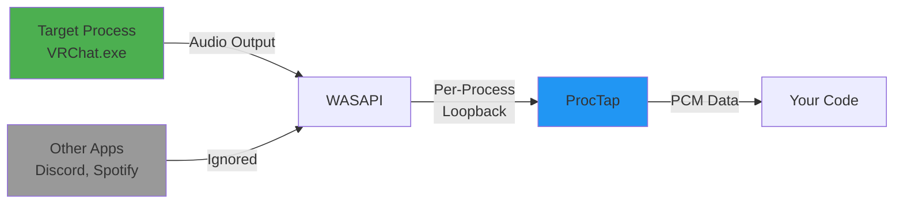

# Quick Start

Get started with ProcTap in just a few minutes!

## Basic Concepts

ProcTap captures audio from a **specific Windows process** using its Process ID (PID). Unlike system-wide recording, this lets you isolate audio from individual applications.



## Finding Process ID

There are several ways to find a process ID:

### Method 1: Task Manager

1. Press ++ctrl+shift+esc++ to open Task Manager
2. Go to the "Details" tab
3. Find your process and note the PID column

### Method 2: Command Line

```bash
# List all processes
tasklist

# Search for specific process
tasklist | findstr "VRChat"
```

### Method 3: Using psutil (Recommended)

```python
import psutil

def find_pid_by_name(name: str) -> int:
    """Find PID by process name."""
    for proc in psutil.process_iter(['pid', 'name']):
        if proc.info['name'].lower() == name.lower():
            return proc.info['pid']
        # Also match without .exe extension
        if proc.info['name'].lower() == f"{name.lower()}.exe":
            return proc.info['pid']
    raise ValueError(f"Process '{name}' not found")

# Find VRChat process
pid = find_pid_by_name("VRChat.exe")
print(f"VRChat PID: {pid}")
```

## Your First Capture

### Example 1: Print Audio Data

```python
from proctap import ProcessAudioCapture

def on_audio(pcm_data: bytes, frame_count: int):
    """Called whenever audio data is available."""
    print(f"Received {len(pcm_data)} bytes ({frame_count} frames)")

# Replace 12345 with your target process ID
tap = ProcessAudioCapture(pid=12345, on_data=on_audio)
tap.start()

input("Capturing audio... Press Enter to stop.\n")
tap.close()
```

### Example 2: Save to WAV File

```python
from proctap import ProcessAudioCapture
import wave

# Open WAV file for writing
wav = wave.open("output.wav", "wb")
wav.setnchannels(2)        # Stereo
wav.setsampwidth(2)        # 16-bit
wav.setframerate(44100)    # 44.1 kHz

def on_audio(pcm_data: bytes, frame_count: int):
    """Write audio data to WAV file."""
    wav.writeframes(pcm_data)

# Capture audio
with ProcessAudioCapture(pid=12345, on_data=on_audio):
    input("Recording... Press Enter to stop.\n")

wav.close()
print("Saved to output.wav")
```

### Example 3: Async Iterator Pattern

```python
import asyncio
from proctap import ProcessAudioCapture

async def capture_audio():
    tap = ProcessAudioCapture(pid=12345)
    tap.start()

    # Process audio chunks asynchronously
    async for chunk in tap.iter_chunks():
        print(f"Got {len(chunk)} bytes")
        # Process the audio data...

        # Example: stop after 100 chunks
        if count >= 100:
            break

    tap.close()

# Run the async function
asyncio.run(capture_audio())
```

## Audio Format

ProcTap always provides audio in this format:

| Parameter | Value |
|-----------|-------|
| Sample Rate | 44,100 Hz (CD quality) |
| Channels | 2 (stereo) |
| Bit Depth | 16-bit |
| Format | PCM (linear) |

!!! note "Fixed Format"
    The audio format is **hardcoded** in the C++ backend and cannot be changed without recompiling.
    The `StreamConfig` class exists for API compatibility but does not affect the actual format.

## Context Manager Pattern

ProcTap supports Python's `with` statement for automatic cleanup:

```python
from proctap import ProcessAudioCapture

def on_audio(data: bytes, frames: int):
    print(f"Audio: {len(data)} bytes")

# Automatically calls close() when exiting
with ProcessAudioCapture(pid=12345, on_data=on_audio):
    input("Press Enter to stop...\n")
# tap.close() is called automatically
```

## Error Handling

Always handle potential errors when working with process audio:

```python
from proctap import ProcessAudioCapture

try:
    tap = ProcessAudioCapture(pid=12345)
    tap.start()

    input("Capturing... Press Enter to stop.\n")

except ProcessLookupError:
    print("Error: Process not found or already terminated")
except PermissionError:
    print("Error: No permission to access process audio")
except Exception as e:
    print(f"Unexpected error: {e}")
finally:
    tap.close()
```

## Complete Example

Here's a complete example that finds a process by name and records to WAV:

```python
from proctap import ProcessAudioCapture
import wave
import psutil
import sys

def find_pid(name: str) -> int:
    """Find PID by process name."""
    for proc in psutil.process_iter(['pid', 'name']):
        if name.lower() in proc.info['name'].lower():
            return proc.info['pid']
    raise ValueError(f"Process '{name}' not found")

def main():
    # Find VRChat process
    try:
        pid = find_pid("VRChat")
        print(f"Found VRChat with PID: {pid}")
    except ValueError as e:
        print(f"Error: {e}")
        sys.exit(1)

    # Setup WAV file
    wav = wave.open("vrchat_audio.wav", "wb")
    wav.setnchannels(2)
    wav.setsampwidth(2)
    wav.setframerate(44100)

    # Capture callback
    def on_audio(data: bytes, frames: int):
        wav.writeframes(data)

    # Start capture
    try:
        with ProcessAudioCapture(pid=pid, on_data=on_audio):
            print("Recording VRChat audio...")
            print("Press Enter to stop.")
            input()
    except KeyboardInterrupt:
        print("\nStopped by user")
    finally:
        wav.close()
        print("Saved to vrchat_audio.wav")

if __name__ == "__main__":
    main()
```

## Next Steps

- [Examples](examples.md) - More advanced examples
- [Basic Usage Guide](../guide/basic-usage.md) - Detailed usage patterns
- [Async API](../guide/async-api.md) - Async/await patterns
- [API Reference](../api/processaudiotap.md) - Complete API documentation
